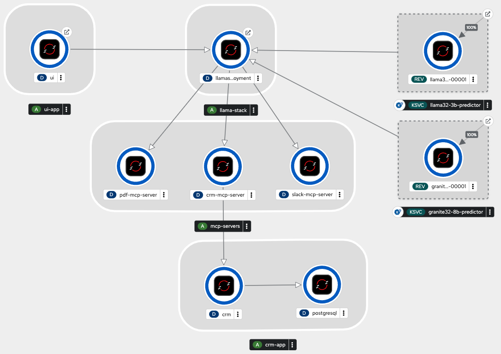

# Red Hat Summit Agentic Demo
Agentic AI Demo Repository for the Red Hat Summit 2025 Booth

This is a work-in-progress (WIP) repository, and modifications will be made.



## Setup

### 1. Databases

Start postgres:

```sh
podman run -it --name postgres \
  -e POSTGRES_USER=claimdb \
  -e POSTGRES_PASSWORD=claimdb \
  -v ./local/import.sql:/docker-entrypoint-initdb.d/import.sql:ro \
  -p 5432:5432 \
  -v /var/lib/data \
  -d postgres
  ```

## 2. MCP Servers

### 2.1 MCP CRM Service

Start the MCP CRM service

```sh
cd mcp-servers/crm
npm install
```

Set the required database environment variables:

```sh
export DB_USER=claimdb
export DB_HOST=localhost
export DB_NAME=claimdb
export DB_PASSWORD=claimdb
```

Run the MCP server using `npx`:

```sh
npx -y supergateway --stdio "node app/index.js"
```

#### 2.1.1 Register the MCP toolgroup

```sh
export LLAMA_STACK_PORT=5001
```

```
curl -X POST -H "Content-Type: application/json" \
  --data '{ "provider_id" : "model-context-protocol", "toolgroup_id" : "mcp::crm", "mcp_endpoint" :{ "uri" : "http://host.containers.internal:8000/sse"}}' \
  http://localhost:$LLAMA_STACK_PORT/v1/toolgroups
```

### 2.2 MCP Python Sandbox

Install deno with 

```sh
brew install deno
```

Run the python sandbox mcp server

```sh
deno run \
  -N -R=node_modules -W=node_modules --node-modules-dir=auto \
  jsr:@pydantic/mcp-run-python sse
```

#### 2.2.2 Register the MCP toolgroup

Register the MCP server

```sh
curl -X POST -H "Content-Type: application/json" \
  --data '{ "provider_id" : "model-context-protocol", "toolgroup_id" : "mcp::python", "mcp_endpoint" :{ "uri" : "http://host.containers.internal:3001/sse"}}' \
  http://localhost:$LLAMA_STACK_PORT/v1/toolgroups

```

### 2.3 MCP PDF Server

Follow the [setup instructions](./mcp-servers/pdf/README.md) to install MCP PDF Server

#### 2.3.1 Register PDF MCP

```sh
curl -X POST -H "Content-Type: application/json" \
  --data '{ "provider_id" : "model-context-protocol", "toolgroup_id" : "mcp::pdf", "mcp_endpoint" :{ "uri" : "http://host.containers.internal:8010/sse"}}' \
  http://localhost:$LLAMA_STACK_PORT/v1/toolgroups
```

### 2.4 MCP Slack Server

Follow the [setup instructions](./mcp-servers/slack/README.md) to install MCP PDF Server

#### 2.3.1 Register Slack MCP

```sh
curl -X POST -H "Content-Type: application/json" \
  --data '{ "provider_id" : "model-context-protocol", "toolgroup_id" : "mcp::slack", "mcp_endpoint" :{ "uri" : "http://host.containers.internal:8000/sse"}}' \
  http://localhost:$LLAMA_STACK_PORT/v1/toolgroups
```

## UI

To run the ui, build it first with podman;

```sh
podman build -t ui -f ui/Containerfile
```

Run the ui connecting to a local instance of Llama Stack on port 5001

```
podman run -p 8501:8501 -e LLAMA_STACK_ENDPOINT=http://host.containers.internal:5001 ui
```


Sample request:

```
Review the current opportunities for ACME
Get a list of support cases for the account
Determine the status of the account, e.g. unhappy, happy etc. based on the cases
Generate a PDF document with a summary of the support cases and the account status
```